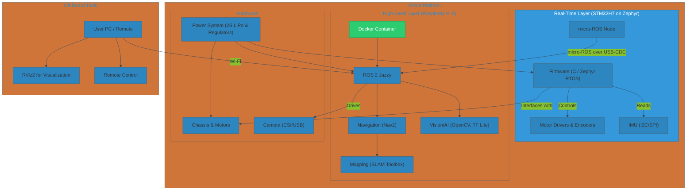

# TheFirstBorn - Advanced Autonomous Mobile Robot


**TheFirstBorn is a modern, autonomous mobile robot built on a professional-grade software and hardware stack. It integrates a real-time STM32 microcontroller running Zephyr RTOS with a high-performance Raspberry Pi 5 for advanced navigation and AI tasks within the ROS 2 ecosystem.**

This project serves as a comprehensive showcase of skills in embedded systems, real-time programming, robotics software integration, and hardware design.

## Key Features

*   **Split-Compute Architecture:** Real-time control on STM32H7, high-level processing on Raspberry Pi 5.
*   **Professional Robotics Framework:** Natively built for **ROS 2**, with the low-level controller is integrated into the ROS 2 graph as a native node via **micro-ROS**.
*   **Autonomous Navigation:** Capable of **SLAM** (Simultaneous Localization and Mapping) and fully autonomous, path-planned navigation with the **Nav2** stack.
*   **AI-Powered Perception:** Supports deployment of lightweight AI models (e.g., TFLite) for onboard object detection and classification
*   **Reproducible Development:** The entire high-level software environment is **containerized with Docker**, ensuring a consistent and easy-to-deploy setup.
*   **Custom Hardware:** Features a custom-designed PCB using **KiCad** for robust power management and peripheral integration.
*   **Advanced RTOS:** Utilizes **Zephyr RTOS** on the STM32 for a modern, secure, and scalable firmware foundation.

## Tech Stack

| Category          | Technology / Tool                                                              |
| ----------------- | ------------------------------------------------------------------------------ |
| **Firmware**      | STM32H7A3, **Zephyr RTOS**, **micro-ROS**, C                                   |
| **High-Level**    | Raspberry Pi 5, Ubuntu 24.04, **ROS 2 Jazzy**, **Docker**                      |
| **Languages**     | C, C++, Python, (exploring **Rust** for performance-critical nodes)            |
| **AI & Vision**   | OpenCV, TensorFlow Lite                                                        |
| **Hardware Design** | **KiCad** (Schematics & PCB Layout)                                            |
| **Version Control** | Git & GitHub                                                                   |

## System Architecture

The robot employs a two-tier, split-compute architecture, which is standard in modern robotics. This separates safety-critical, real-time tasks from computationally intensive, non-real-time tasks.

*   **Real-time Control Layer (STM32H7):** Running Zephyr RTOS, this MCU is responsible for all hard real-time operations:
    *   Motor control via PWM.
    *   Reading wheel encoders for odometry feedback.
    *   Interfacing with low-level sensors like an IMU.
    *   It communicates with the high-level layer by running a **micro-ROS agent**, exposing its functionality as ROS 2 topics, services, and parameters.

*   **High-Level Processing Layer (Raspberry Pi 5):** Running a Dockerized ROS 2 environment, this SBC is the robot's brain:
    *   Hosts the main ROS 2 nodes.
    *   Runs SLAM and navigation algorithms (Nav2).
    *   Performs sensor fusion and computer vision processing.
    *   Executes AI/ML models.
    *   Handles all wireless communication.

## System Architecture Diagram



## Project Status

- [x] **Phase 0: Architecture & Technology Selection**
- [ ] **Phase 1: Hardware Design & Fabrication**
    - [ ] Component selection (motors, drivers, sensors)
    - [ ] PCB design in KiCad
    - [ ] PCB ordering and assembly
    - [ ] Mechanical chassis design (CAD) and 3D printing
- [ ] **Phase 2: Firmware Development (STM32)**
    - [ ] Zephyr RTOS base project setup
    - [ ] Motor driver and encoder implementation
    - [ ] IMU driver integration
    - [ ] micro-ROS node implementation (subscribing to `/cmd_vel`, publishing `/odom`)
- [ ] **Phase 3: High-Level Software (Raspberry Pi)**
    - [ ] Create Dockerfile and Docker Compose for ROS 2 environment
    - [ ] Basic teleoperation node (`teleop_twist_keyboard`)
    - [ ] Create robot description (URDF)
    - [ ] Launch files for core nodes
- [ ] **Phase 4: Integration & SLAM**
    - [ ] Establish robust communication between STM32 and RPi
    - [ ] Configure `slam_toolbox` with camera/LiDAR to create a map
    - [ ] Tune odometry and TF frames
- [ ] **Phase 5: Autonomous Navigation**
    - [ ] Configure and tune the Nav2 stack
    - [ ] Achieve successful goal-based navigation in a mapped environment
- [ ] **Phase 6: AI & Advanced Capabilities**
    - [ ] Implement a basic object detection node
    - [ ] (Optional) Rewrite a performance-critical node in Rust

## Getting Started

### Prerequisites

1.  Git, Zephyr development environment (`west`), STM32 toolchain.
2.  Docker and Docker Compose installed on your development machine.
3.  A Raspberry Pi 5 with Ubuntu 24.04 and Docker installed.

### Build & Run

1.  **Clone the repository:**
    ```bash
    git clone https://github.com/your-username/TheFirstBorn.git
    cd TheFirstBorn
    ```

2.  **Flash the Firmware (STM32):**
    ```bash
    cd firmware
    west build -b your_stm32h7_board -p auto
    west flash
    ```

3.  **Deploy the Software (Raspberry Pi):**
    *   The `software` directory is self-contained. Transfer it to your Raspberry Pi.
    *   From within the `software` directory on the RPi, launch the entire ROS 2 stack:
    ```bash
    # Build the docker image (only needs to be done once or when Dockerfile changes)
    docker-compose build

    # Launch all ROS 2 nodes
    docker-compose up
    ```

## Folder Structure

```
/TheFirstBorn
├── README.md             # This file: Project overview
├── docs/                 # Detailed documentation, requirements, decisions
├── hardware/             # KiCad files (schematics, PCB) and mechanical CAD
├── firmware/             # Zephyr RTOS project for the STM32H7
├── software/             # ROS 2 packages and Docker configuration for the RPi 5
└── media/                # Images, GIFs, and videos for documentation
```

## Documentation Links

*   [Project Requirements](./docs/requirements.md)
*   [Design Decision Log](./docs/decisions_log.md)
  
## License

This project is licensed under the Apache License, Version 2.0.  
See the [LICENSE](./LICENSE) file for details.

