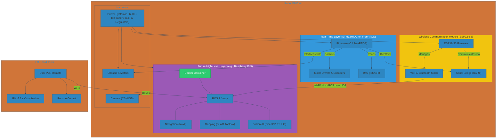

# TheFirstBorn - Advanced Autonomous Mobile Robot


**TheFirstBorn is a modern, autonomous mobile robot built on a professional-grade software and hardware stack. It integrates a real-time STM32H7A3 microcontroller running FreeRTOS for direct sensor input and motor control, with an ESP32-S3 acting as a wireless communication module within the ROS 2 ecosystem.**

This project serves as a comprehensive showcase of skills in embedded systems, real-time programming, robotics software integration, and hardware design.

## Key Features

*   **Split-Compute Architecture:** Real-time control on STM32H7A3, wireless communication via ESP32-S3, high-level processing on a companion computer (e.g., Raspberry Pi 5 - *to be integrated later*).
*   **Professional Robotics Framework:** Natively built for **ROS 2**, with the low-level controller integrated into the ROS 2 graph as a native node via **micro-ROS**.
*   **Autonomous Navigation:** Capable of **SLAM** (Simultaneous Localization and Mapping) and fully autonomous, path-planned navigation with the **Nav2** stack (when integrated with a high-level compute unit).
*   **AI-Powered Perception:** Supports deployment of lightweight AI models (e.g., TFLite) for onboard object detection and classification (when integrated with a high-level compute unit).
*   **Reproducible Development:** The high-level software environment (when implemented) will be **containerized with Docker**, ensuring a consistent and easy-to-deploy setup.
*   **Custom Hardware:** Features a custom-designed PCB using **KiCad** for robust power management and peripheral integration.
*   **Advanced RTOS:** Utilizes **FreeRTOS** on the STM32H7A3 for a lightweight, reliable, and widely-supported firmware foundation.

## Tech Stack

| Category          | Technology / Tool                                                              |
| ----------------- | ------------------------------------------------------------------------------ |
| **Firmware**      | STM32H7A3, **FreeRTOS**, **micro-ROS**, C, C++                                |
| **Wireless Module** | ESP32-S3 (acting as a Wi-Fi/Bluetooth bridge)                                  |
| **High-Level**    | (Future: Raspberry Pi 5, Ubuntu 24.04, **ROS 2 Jazzy**, **Docker**)            |
| **Languages**     | C, C++, Python, (exploring **Rust** for performance-critical nodes)            |
| **AI & Vision**   | OpenCV, TensorFlow Lite (Future: on high-level compute)                        |
| **Hardware Design** | **KiCad** (Schematics & PCB Layout)                                            |
| **Version Control** | Git & GitHub                                                                   |

## System Architecture

The robot employs a two-tier, split-compute architecture, separating safety-critical, real-time tasks from wireless communication and computationally intensive, non-real-time tasks.

*   **Real-time Control Layer (STM32H7A3):** Running FreeRTOS, this MCU is responsible for all hard real-time operations:
    *   Motor control via PWM.
    *   Reading wheel encoders for odometry feedback.
    *   Interfacing with low-level sensors like an IMU.
    *   It communicates with the high-level layer (or directly with the micro-ROS agent) via a serial interface (e.g., UART) to the ESP32-S3.

*   **Wireless Communication Module (ESP32-S3):** Configured to act primarily as a Wi-Fi/Bluetooth bridge:
    *   Handles robust wireless communication (Wi-Fi, Bluetooth).
    *   Acts as a transport layer for `micro-ROS` messages between the STM32H7A3 and a remote `micro-ROS` agent/ROS 2 ecosystem.
    *   Potentially offloads some sensor data processing or basic commands.

*   **High-Level Processing Layer (Future Integration - e.g., Raspberry Pi 5):** This SBC will be the robot's brain when integrated:
    *   Hosts the main ROS 2 nodes.
    *   Runs SLAM and navigation algorithms (Nav2).
    *   Performs sensor fusion and computer vision processing.
    *   Executes AI/ML models.
    *   Connects wirelessly to the ESP32-S3.

## System Architecture Diagram



## Project Status

* [x] **Phase 0: Architecture & Technology Selection**
* [ ] **Phase 1: Hardware Design & Fabrication**

  * [ ] Component selection (motors, drivers, sensors, STM32H7A3, ESP32-S3 module)
  * [ ] PCB design in KiCad
  * [ ] PCB ordering and assembly
  * [ ] Mechanical chassis design (CAD) and 3D printing
* [ ] **Phase 2: Firmware Development (STM32H7A3)**

  * [ ] FreeRTOS base project setup
  * [ ] Motor driver and encoder implementation
  * [ ] IMU driver integration
  * [ ] Serial communication with ESP32-S3
  * [ ] (Future) `micro-ROS` client integration on STM32H7A3
* [ ] **Phase 3: Wireless Module Firmware (ESP32-S3)**

  * [ ] ESP-IDF base project setup
  * [ ] Wi-Fi/Bluetooth configuration as a communication bridge
  * [ ] Serial communication with STM32H7A3
  * [ ] `micro-ROS` agent/client implementation on ESP32-S3 for forwarding messages
* [ ] **Phase 4: High-Level Software (Future: Raspberry Pi / Companion Computer)**

  * [ ] Create Dockerfile and Docker Compose for ROS 2 environment
  * [ ] Basic teleoperation node (`teleop_twist_keyboard`)
  * [ ] Create robot description (URDF)
  * [ ] Launch files for core nodes
* [ ] **Phase 5: Integration & SLAM**

  * [ ] Establish robust communication between STM32H7A3, ESP32-S3, and companion computer
  * [ ] Configure `slam_toolbox` with camera/LiDAR to create a map
  * [ ] Tune odometry and TF frames
* [ ] **Phase 6: Autonomous Navigation**

  * [ ] Configure and tune the Nav2 stack
  * [ ] Achieve successful goal-based navigation in a mapped environment
* [ ] **Phase 7: AI & Advanced Capabilities**

  * [ ] Implement a basic object detection node
  * [ ] (Optional) Rewrite a performance-critical node in Rust

## Getting Started

### Prerequisites

1.  Git, STM32 toolchain (e.g., STM32CubeIDE/GCC ARM Embedded), FreeRTOS, ESP-IDF SDK, ESP32-S3 toolchain.
2.  Docker and Docker Compose installed on your development machine (if using a companion computer).
3.  A companion computer (e.g., Raspberry Pi 5) with Ubuntu 24.04 and Docker installed (for Phase 4+).

### Build & Run

WIP

## Folder Structure

```
/TheFirstBorn
├── README.md             # This file: Project overview
├── docs/                 # Detailed documentation, requirements, decisions
├── hardware/             # KiCad files (schematics, PCB) and mechanical CAD
├── firmware/             # FreeRTOS project for the STM32H7A3
├── esp_wireless/         # ESP-IDF project for the ESP32-S3 wireless module
├── software/             # ROS 2 packages and Docker configuration (for companion computer)
└── media/                # Images, GIFs, and videos for documentation
```

## Documentation Links

*   [Project Requirements](./docs/requirements.md)
*   [Design Decision Log](./docs/decisions_log.md)
*   [Components list](./docs/components.md)
*   [MicroROS with STM32 & ESP32 Integration](./docs/microROS_stm32_esp32.md)

## License

This project is licensed under the Apache License, Version 2.0.
See the [LICENSE](./LICENSE) file for details.
