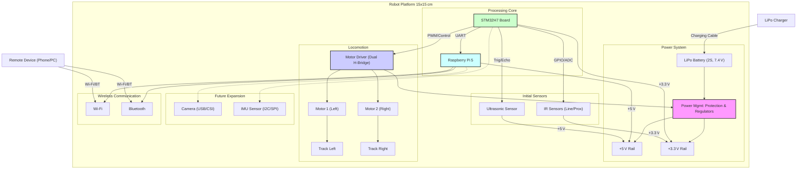

# TheFirstBorn - Small Mobile Robot Project

A compact, modular mobile robot designed for autonomous indoor navigation and interaction tasks. Built using STM32 for real-time control and Raspberry Pi for high-level processing, focusing on affordability and extensibility for hobbyist development.

## Goals

*   Build a functional mobile robot with a footprint of approximately 15x15 cm.
*   Implement autonomous navigation capabilities (e.g., obstacle avoidance).
*   Enable wireless remote control and telemetry feedback.
*   Achieve a minimum speed of 0.5 m/s.
*   Ensure 30-60 minutes of operational autonomy on battery power.
*   Maintain a budget of approximately €100 / $100 for new components (excluding existing STM32H7 and RPi 5).
*   Design for modularity to facilitate future upgrades (sensors, actuators, locomotion).
*   Integrate potential for future ROS2 usage via the Raspberry Pi.

## Current Status

**Phase 1: Concept & Requirements** - Finalized.
**Next:** Phase 2 (Mechanical Design - Component Selection) & Phase 3 (Electronics - Component Selection).

## Key Features (Planned)

*   **Processing:** Dual-core architecture (STM32H7 for real-time, Raspberry Pi 5 for high-level).
*   **Communication:** UART communication between STM32 and RPi.
*   **Locomotion:** Initial design uses tracked drive (2 motors), with mechanical provisions for future omni-wheel upgrade (3 or 4 motors).
*   **Power:** 2S LiPo battery with appropriate voltage regulation (5V, 3.3V).
*   **Sensing (Initial):** IR proximity/line sensors and Ultrasonic distance sensor(s) connected to STM32.
*   **Wireless:** Leveraging RPi 5's built-in Wi-Fi and Bluetooth for RC and telemetry.
*   **Construction:** Primarily 3D printed or laser-cut plastic components.

## High‑Level Block Diagram



## Folder Structure

```
/TheFirstBorn
├── README.md             # This file: Project overview
├── docs/                 # General documentation, requirements, decisions
├── mechanical/           # CAD files, assembly, mechanical BOM
├── electronics/          # Schematics, PCB layout, electronics BOM
├── firmware/             # STM32 code
├── software/             # Raspberry Pi code
├── config/               # Configuration files (calibration, etc.)
└── media/                # Images, videos used in documentation
```

## Documentation Links

*   [Project Requirements](./docs/requirements.md)
*   [Design Decision Log](./docs/decisions_log.md)

## Next Steps

*   Begin research and selection for specific motors, tracks, and chassis materials (Phase 2).
*   Begin research and selection for motor driver, power management components, and initial sensors (Phase 3).
```

---

**File: `docs/requirements.md`**

````markdown
# Project Requirements - TheFirstBorn

This document outlines the specific requirements for the "TheFirstBorn" mobile robot project.

## 1. Core Functionality

*   **1.1 Initial:** Implement basic autonomous navigation including obstacle avoidance using low-cost sensors.
*   **1.2 Initial:** Enable wireless remote control (RC car style) via Wi-Fi or Bluetooth.
*   **1.3 Initial:** Provide wireless telemetry data (e.g., battery status, basic sensor readings).
*   **1.4 Future:** Implement ball following capability (likely requiring a camera and vision processing on RPi).
*   **1.5 Future:** Support for ROS2 nodes running on the Raspberry Pi for higher-level planning and control.

## 2. Performance

*   **2.1 Size:** Maintain a footprint of approximately 15 cm x 15 cm. Height TBD based on components.
*   **2.2 Speed:** Achieve a maximum controllable speed of at least 0.5 meters per second on a typical indoor surface.
*   **2.3 Autonomy:** Operate for a minimum of 30 minutes, targeting up to 60 minutes, on a single battery charge under typical load.

## 3. Architecture

*   **3.1 Processing:** Utilize a dual-controller approach:
    *   STM32H7 (existing board): For real-time tasks (motor control, low-level sensor reading, timing-critical operations).
    *   Raspberry Pi 5 (existing board): For high-level tasks (wireless communication, user interface logic, future vision processing, potential ROS2 nodes, coordination).
*   **3.2 Inter-MCU Communication:** Implement communication between STM32 and RPi via UART as the primary method initially. Define a simple serial protocol for commands and data exchange.

## 4. Locomotion

*   **4.1 Initial Configuration:** Utilize a tracked drive system (skid-steer) with two DC motors.
*   **4.2 Future Compatibility:** The mechanical chassis design must allow for a future upgrade to an omni-wheel drive system (3 or 4 motors) without requiring a complete chassis redesign (e.g., appropriate mounting points).

## 5. Power System

*   **5.1 Battery:** Use a rechargeable Lithium Polymer (LiPo) battery, likely 2S (7.4V nominal), with appropriate capacity for the autonomy target.
*   **5.2 Regulation:** On-board voltage regulation required to provide stable power rails:
    *   +5V for Raspberry Pi, potentially some sensors/peripherals.
    *   +3.3V for STM32 microcontroller and most sensors.
*   **5.3 Protection:** Include basic battery protection (e.g., over-discharge monitoring, possibly a dedicated protection IC or relying on charger features).
*   **5.4 Charging:** Utilize an external LiPo balance charger. On-board charging is not required for the initial version.

## 6. Sensing (Initial)

*   **6.1 Obstacle Avoidance (Close Range):** Employ Infrared (IR) proximity sensors.
*   **6.2 Obstacle Avoidance (Medium Range):** Employ at least one Ultrasonic distance sensor (e.g., HC-SR04 type).
*   **6.3 Sensor Interface:** All initial sensors should interface directly with the STM32H7.

## 7. Wireless Communication

*   **7.1 Hardware:** Leverage the built-in Wi-Fi and Bluetooth capabilities of the Raspberry Pi 5.
*   **7.2 Use Cases:** Support remote control commands and transmission of telemetry data to a remote device (PC/phone).

## 8. Modularity & Expansion

*   **8.1 Hardware:** The main PCB design should include expansion headers exposing spare STM32 GPIO pins, power rails (3.3V, 5V, Vin), and common communication buses (I2C, SPI) if available. Consider footprints for standard sensor connectors (e.g., Grove, Stemma QT/Qwiic) if budget/space permits.
*   **8.2 Software:** Firmware (STM32) and high-level code (RPi) should be structured in a modular fashion (functions, classes, libraries, future ROS2 packages) to simplify adding new functionalities.

## 9. Constraints & Environment

*   **9.1 Budget:** Total cost for *new* components (motors, drivers, sensors, PCB, power components, chassis materials, fasteners) must remain around €100 / $100.
*   **9.2 Existing Hardware:** Leverage the available STM32H7 development board and Raspberry Pi 5.
*   **9.3 Operating Environment:** Designed for indoor use on relatively flat surfaces (e.g., hardwood, tile, low-pile carpet) under normal indoor lighting conditions.
*   **9.4 Noise:** No specific noise level restrictions.
*   **9.5 Environmental Protection:** No waterproofing or dust-proofing required.
*   **9.6 Regulations:** Hobby project, no specific regulatory compliance needed.

## 10. Deferred Features (Not in Initial Scope)

*   **10.1 Display:** Small screen for expressions or status output.
*   **10.2 Audio Output:** Sound/speech generation capability.
*   **10.3 Advanced Sensors:** IMU, Camera (required for ball following).
*   **10.4 On-board Charging:** Integrated battery charging circuit.
```

---

**File: `docs/decisions_log.md`**

````markdown
# Design Decision Log - TheFirstBorn

This log records key design decisions made during the development of the "TheFirstBorn" robot.

**Format:**

*   **Date:** Date the decision was finalized.
*   **Topic:** Area of the design the decision relates to.
*   **Options Considered:** Brief list of alternatives evaluated.
*   **Decision:** The chosen approach or component.
*   **Rationale:** Justification for the decision (pros/cons, cost, availability, requirements alignment, etc.).

---

**Date:** 2024-03-10 (Initial Planning)
**Topic:** Core Processing Architecture
**Options Considered:**
    *   Single High-Power MCU (e.g., STM32H7 alone)
    *   Single Linux Board (e.g., Raspberry Pi alone)
    *   Dual Controller: Real-time MCU + Linux Board
**Decision:** Dual Controller: STM32H7 + Raspberry Pi 5
**Rationale:** Leverages existing hardware owned by the developer. Provides separation of concerns: STM32 excels at real-time control (motors, sensors) critical for robotics, while RPi 5 offers powerful processing, easier networking, camera support, and potential for ROS2 integration needed for higher-level tasks and future expansion. Avoids overloading a single processor.

---

**Date:** 2024-03-10
**Topic:** Inter-Controller Communication
**Options Considered:**
    *   UART (Serial)
    *   SPI
    *   I2C
    *   USB (via USB-to-serial on STM32 side)
    *   Ethernet (requires add-on for STM32)
**Decision:** UART
**Rationale:** Simple, widely supported on both platforms, sufficient bandwidth for initial command/telemetry needs. Low pin count required. Well-understood protocol. SPI/I2C are viable but often used for peripheral communication; USB adds complexity/cost.

---

**Date:** 2024-03-10
**Topic:** Initial Locomotion Type
**Options Considered:**
    *   2-Wheel Differential Drive
    *   4-Wheel Differential Drive
    *   Tracked Drive (Skid Steer)
    *   Omni-directional Wheels (3 or 4)
**Decision:** Tracked Drive (2 Motors)
**Rationale:** Balances cost, simplicity, and performance for indoor use. Tracks offer good traction and handle minor floor imperfections well. Keeps initial motor/driver count low to meet budget. Design will allow for future omni-wheel upgrade for enhanced maneuverability.

---

**Date:** 2024-03-10
**Topic:** Initial Sensing Strategy
**Options Considered:**
    *   Ultrasonic only
    *   IR only
    *   Combination of Ultrasonic and IR
    *   LiDAR (Low cost variants)
    *   Camera (Vision-based)
**Decision:** Combination: IR sensors (Close range / Line) + Ultrasonic sensor (Medium range)
**Rationale:** Provides complementary sensing capabilities at low cost. IR is good for detecting edges or very close obstacles. Ultrasonic gives distance estimates over a slightly longer range. LiDAR is generally outside the budget. Camera is planned for future enhancement (ball following). Sensors interface directly to STM32 for real-time readings.

---

**Date:** 2024-03-10
**Topic:** Wireless Communication Hardware
**Options Considered:**
    *   Add dedicated ESP32 module (for Wi-Fi/BT)
    *   Use RPi 5 built-in Wi-Fi/Bluetooth
    *   Use STM32-compatible Wi-Fi/BT module
**Decision:** Use Raspberry Pi 5 built-in Wi-Fi and Bluetooth
**Rationale:** Leverages existing hardware capability. Simplifies hardware design and reduces cost/complexity compared to adding a separate wireless module. RPi is well-suited for handling network stacks and higher-level communication protocols.

---

**Date:** 2024-03-10
**Topic:** Budget for New Components
**Options Considered:**
    *   < €50 (Very challenging)
    *   ~ €100
    *   ~ €200+ (More flexibility)
**Decision:** Target ~€100 / $100 for new components.
**Rationale:** Stems from user requirement for an "affordable" hobby project. Excludes cost of existing STM32H7 board and RPi 5. Requires careful component selection, particularly for motors, drivers, and potentially chassis materials (favoring DIY/3D printing).

---
*(Add new decisions here as the project progresses)*

---

Remember to commit these files to your Git repository. This provides a solid foundation for documenting the project as it evolves. We can now proceed to discuss Phase 2 (Mechanical) and Phase 3 (Electronics) component selection when you're ready.
